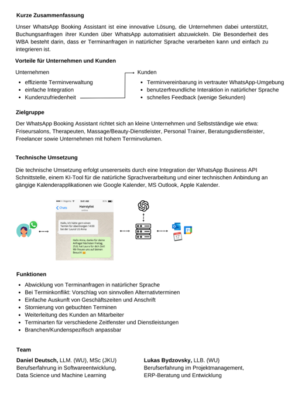
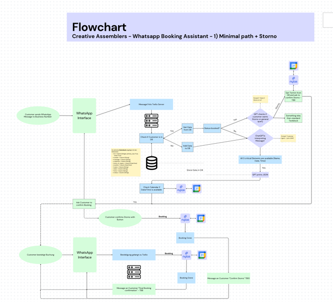

# Smart appointments
(Text-nlp,
Prompt engineering, Fullstack)

Fullstack app integrating ChatGPT to WhatsApp and providing an AI-based smart scheduling bot. Programming instant messaging using Communication Platform as a service (CPaaS)

Techstack:

- OpenAI ChatGPT API 

- Twilio API

- Nylas Booking

- PostgreSQL

- REST API

# Projektbeschreibung

https://creativeassemblers.notion.site/Creative-Assemblers-d7af6f24af84460db2a1f38e7f6f424b

# Paths

More on https://www.canva.com/design/DAFqkTpN-I8/HDjZ8aUxc_eUw9dcrQOuIQ/edit